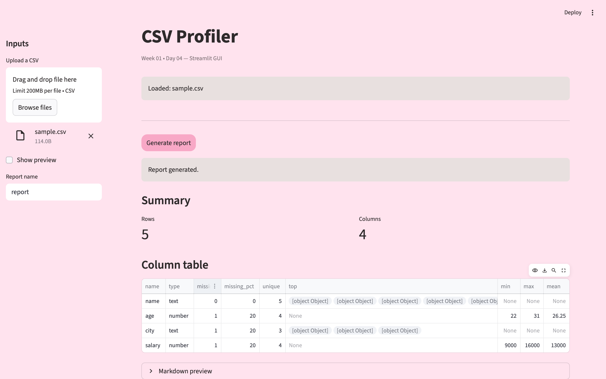

# CSV Profiler  
**Implemented by Luluh Almogbil**

CSV Profiler is a small local project that helps you quickly understand and analyze any CSV file.

It works in two ways:
- **CLI** → generate reports directly from the terminal  
- **Streamlit GUI** → upload a CSV file and explore it in the browser  

The project is intended to run **locally** using Python and `uv`.

A preview of the Streamlit app used to upload CSV files and generate reports:


---

## What It Does

Given a CSV file, the profiler:

- Counts rows and columns  
- Detects column types (text / numeric)  
- Calculates missing values  
- Shows unique values  
- Computes basic statistics for numeric columns  
- Generates reports in **JSON** and **Markdown** formats  

---

## Requirements

You need:

- **Python 3.11**
- **uv**  
  https://github.com/astral-sh/uv

---

## Setup (Run Once)

From the project root directory, run:

```bash
uv venv -p 3.11
uv pip install -r requirements.txt

This will:

- Create a virtual environment

- Install all required dependencies

Run the CLI

The CLI allows you to profile a CSV file directly from the terminal.

Important Note:
The project code lives inside a src/ folder, so you must set:
PYTHONPATH=src

Mac / Linux
PYTHONPATH=src
uv run python -m csv_profiler.cli profile data/sample.csv --out-dir outputs

Windows (PowerShell)
$env:PYTHONPATH="src"
uv run python -m csv_profiler.cli profile data/sample.csv --out-dir outputs

Expected Output
A folder named outputs/ will be created
Inside it, you will find:
- report.json
- report.md

Run the Streamlit GUI (Second Way)

The Streamlit app provides a simple web interface for profiling CSV files.

PYTHONPATH=src is also required here

Mac / Linux
PYTHONPATH=src
uv run streamlit run app.py

Windows (PowerShell)
$env:PYTHONPATH="src"
uv run streamlit run app.py

After running the command, open the URL shown in the terminal
(usually: http://localhost:8501
)
